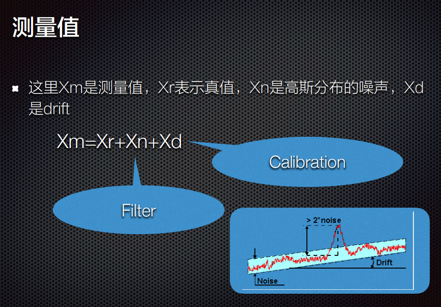

# 传感器的静态特性

灵敏度

分辨力

测量范围和量程

误差特性

## 传感器的误差

测量系统和标准量本身精度有限

实验手段不完善

有些方法在理论上是近似的

多数被测值不能用一个有限的数组表现出来

被测量是随着事件变化的

外界噪声的干扰

感知信息的不确定性

## 传感器的标定

* 确定传感器的性能指标

* 明确这些性能指标所适用的工作环境

## 校准

传感器校准是一种消除传感器测量误差的方法，他可以改变传感器的预测值和测量值的差异

