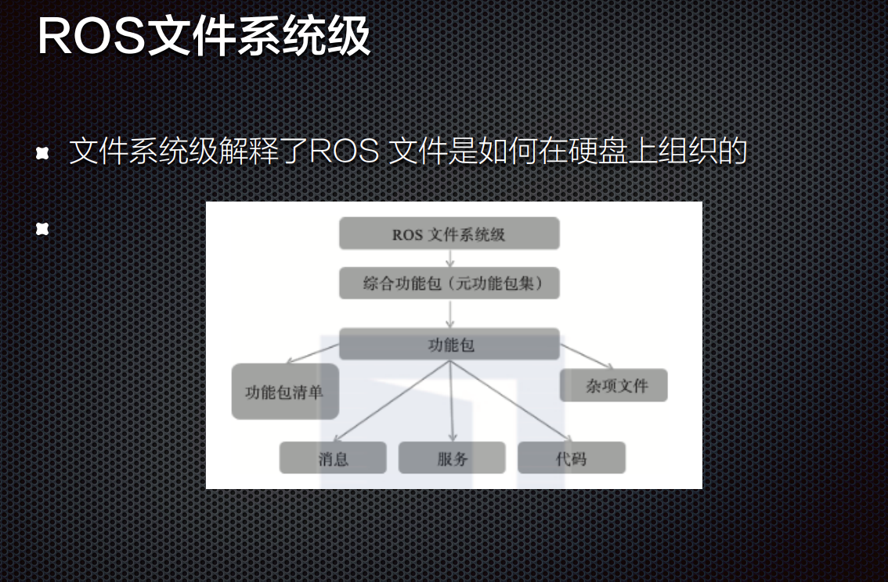

# ROS 核心概念

节点Nodes

节点管理器ROS Master

消息和主题Messages and Topics

服务Services

动作action

参数Parameters

包Packages、栈Stacks、Meta Packages

# ROS 节点

ROS节点

单一用途的可执行程序

例如传感器驱动、执行器驱动、地图构建、规划、UI等

单独编译、执行和管理

使用ROS客户端库编写节点

roscpp - c++客户端库

python客户端库

节点可以发布或订阅Topic

节点也可以提供或使用服务或行动

# ROS 节点管理器Master

为各节点提供连接信息，以便各节点之间互通消息

跟踪和记录主题/服务通信，辅助节点相互查找、建立连接

提供参数服务器，节点使用此服务器存储和检索运行时的参
数

环境参数ROS_MASTER_URI包含ROS Master的IP和
port

ROS2中已不存在！！！

# ROS 主题

主题：已定义类型的命名消息流

可对名为scan主题发送来自测距仪的数据，消息类型为LaserScan

节点之间通过向主题发布消息彼此通信

异步通信

发布者/订阅者模式:

广播
单个节点可以发布和订阅多个主题