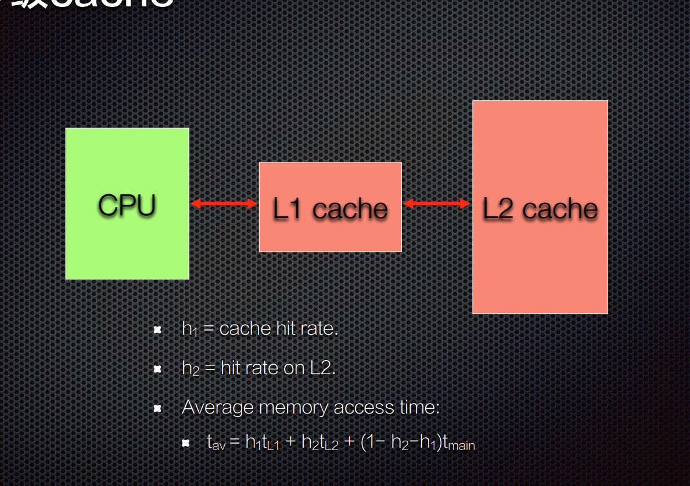

# 易失性存储器

断电时内容消失的存储器

随机存取存储器（RAM）

SRAM

* 速度快，面积大

DRAM

* 保持数据的时间很短，徐娅定期刷新

* 比SRAM更加不稳定

# 非易失性存储器

不需要持续供电来保存存储在计算设备中的数据或者程序代码

* ROM Mask ROM

* Electrically Erasable Programmable ROM

* 快闪存储器 Flash

* 磁盘存储器

# 固件

firmware一般存储设备中的电可擦除只读存储器EEPROM或者FLASH芯片中，一般可以由用户通过特定的刷新程序进行升级的程序

ROMable：可以被编程到ROM芯片中的机器语言

* 代码将从ROM正确执行

* 代码和数据不能混用 作为“只读”芯片不能更新，可固化程序必须使用RAM或磁盘来保存变化的数据

# Flash

有比较快的读取时间，但是比SRAM和DRAM慢

写入时间大大超过读取时间，而且写入的次数是有限的

## 类型

NOR ： 按快擦除，擦除和写入的时间比较长，但是能够像RAM那样访问

NAND：以块为单位，一个数据块是数百或者数千比特；擦除和写入速度比较快，按页读取

# 存储器层次结构

处理器寄存器

缓冲寄存器： Cache TLB SPM

工作存储器：主存

flash， 磁盘， 云

# Cache 

在设计时预测缓存是否命中是很困难的，并且对于实时性能的精确预测而言也是一个负担

# SPM

Scratchpad Memory SPM

SPM和主存同一编制，每当某个简单的地址解码器给出一个SPM地址范围的地址时候，SPM就被访问

和处理器集成在一个芯片上

应用软件自主管理的片上存储器技术

功耗低，速度快
