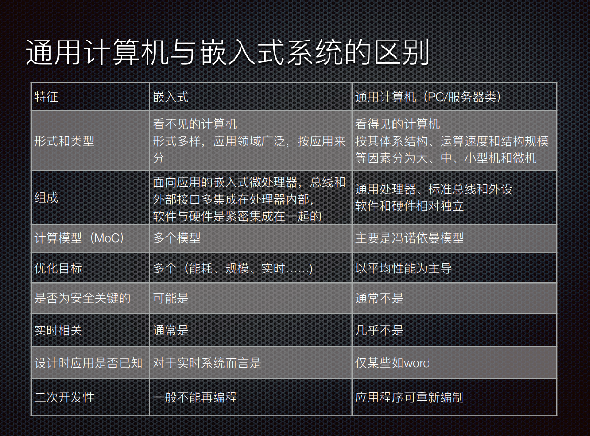

# 嵌入式的定义

用于控制，监视或者辅助操作机器和设备的装置

# 嵌入式系统的三要素

嵌入性：嵌入到对象体系中，对于对象环境有要求

专用性：软硬件按照对象要求设计裁剪

计算机：实现对象的智能化功能

# 嵌入式系统的组成

应用软件

中间件

运行/实时内核

驱动

系统硬件

* 主要由嵌入式硬件和软件组成

* 硬件以微处理器为核心集成存储后期和系统专用的输入输出设备

* 软件包括初始化代码以及驱动，嵌入式操作系统和应用程序，这些软件有机结合再一起，形成系统也顶的一体化软件

# 通用计算机和嵌入式系统的区别

# 嵌入式系统安全

* 数据存储不安全

* 服务端控制措施部署不当

* 传输过程中没有加密

* 身份认证措施不当

* 密钥保护措施不当

* 会话处理不当

# 嵌入式

* 一般用于特定的任务，其硬件和软件都必须高效地设计，可剪裁

* 采用多种类型地处理器和处理器体系结构

* 通常具有低功耗，体积小，集成度高等特点，能够把通用微处理器中许多由板卡完成地任务集成在芯片内部

# 高度制约的环境

* 嵌入式系统通常工作在资源高度受限的环境中，这是的系统设计极具挑战性

* 大多数的嵌入式系统收到处理器速度，存储器容量和用户接口的限制

* 很多运行于一个不可控制的恶劣环境中，需要克服高温，环境，超市，振动，冲击甚至腐蚀

* 嵌入式系统必须满足计算任务和完成任务的前提下优化尺寸，重量，可靠性，性能，成本和能耗方面的设计

# 实时性要求

* 一方面大多数实时系统都是嵌入式系统

* 嵌入式系统大多数有实时性要求，具有事件约束条件，必须在给定的事件范围内处理完事件

    * 交互系统中系统响应延迟可能会造成人们的不方便，二实时系统的延迟可能是灾难性的

* 实时嵌入式系统通常包括实时控制

    * 在无人干预的情况下，基于输入数据和当前状态所作出的控制决策

# 安全性和可靠性的要求

* 部分实时嵌入系统是安全至上并且必须是具有高度的可靠性

* 安全性的含义是“远离事故和损失”，关注没有故障以及在单点故障下是否安全

* 可靠性指一个系统或者不见在给定事件和给定条件下实现要求功能的能力

    * 出错处理和自动复位的能力

    * 嵌入式系统的软件中一般都包括一些机制，比如硬件的看门狗定时器，软件的内存保护和重启动机制

# 关注成本

# 并发性

# 嵌入式系统分类

## 按照位数

4 - 64 bit 32bit为主流

## 按照应用

## 按照速度

强实时， 一般实时， 弱实时

## 确定性

根据确定性的强弱--硬实时和软实时

硬实时： 系统对于系统响应时间有严格的要求---致命错误

软实时： ---非致命错误

## 复杂程度

循环轮询系统，有限状态机系统，前后台系统，单处理器多任务系统，多处理器多任务系统