# 1．嵌入式系统概述
## 定义
IEEE：用于**控制、监视或者辅助操作机器和设备的装置**

国内：嵌入式系统是**以应用为中心，以计算机技术为基础，软硬件可裁减，适用于应用系统对功能、可靠性、成本、体积、功耗有严格要求的专用计算机系统**

三要素：
- 嵌入性：嵌入到对象体系中，有对象环境要求 
- 专用性：软、硬件按对象要求设计、裁减 
- 计算机：实现对象的智能化功能
## 术语
1. 泛在计算（ubiquitous computing） 预言任何时间、任何地点的计算 
2. 不可见计算机（invisible computer） 预言计算机将被集成到物件中 
3. 普适计算（pervasive computing） 计算设备对日常生活的渗透 
4. 环境智能（ambient intelligence） 主要强调了未来家庭或智能楼宇中的通信技术
## 组成
1. 嵌入式系统一般由**嵌入式硬件和软件**组成
2. 硬件以**微处理器**为核心集成存储器和系统专用的**输入/输出设备**
3. 软件包括：**初始化代码及驱动、嵌入式操作系统和应用程序**等，这些软件有机地结合在一起，形成系统特定的一体化软件。
![[./img/Pasted image 20250106194302.png|293]]
## 特征
1. 嵌入式系统通常是**形式多样、面向特定应用**的
2. 嵌入式系统得到**多种类型的处理器和处理器体系结构**的支持
3. 嵌入式系统通常极其关注**成本**
4. 嵌入式系统有**实时性和可靠性**的要求
5. 嵌入式系统使用的操作系统一般是**适应多种处理器、可剪裁、轻量型、实时可靠、可固化**的嵌入式操作系统
6. 嵌入式系统开发需要**专门工具和特殊方法**

![[./img/Pasted image 20250106194944.png|525]]
## 分类
1. 按嵌入式处理器的位数来分类
	1. 4,8,16：大量应用
	2. 32位：正成为主流
	3. 64位：高度复杂的、高速的嵌入式系统已经开始采用
2. 按应用来分类
	1. 移动互联网
	2. 可穿戴设备
	3. ...
3. 按速度分类
	1. 强实时系统, 其系统响应时间在毫秒或微秒级。
	2. ⼀般实时系统, 其系统响应时间在⼏秒的数量级上,其实时性的要求⽐强实时系统要差⼀些。
	3. 弱实时系统, 其系统响应时间约为数⼗秒或更⻓。这种系统的响应时间可能随系统负载的轻重⽽变化。
4. 按确定性来分类
	1. 硬实时：系统对系统响应时间有严格的要求，如果系统响应时间不能满⾜，就要引起系统崩溃或致命的错误。
	2. 软实时：系统对系统响应时间有要求，但是如果系统响应时间不能满⾜，不会导致系统出现致命的错误或崩溃。
5. 按嵌入式系统软件复杂程度来分类
	1. 循环轮询系统
	2. 有限状态机系统
	3. 前后台系统
	4. 单处理器多任务系统
	5. 多处理器多任务系统
## 典型应用
## 发展趋势
嵌入式人工智能 
安全 
不断增加的计算需求，不断增加的复杂性 
互连的需求 
日益增长的灵活性需求 
在不断变化的标准下进入市场的时间（Time-To-Market，TTM） 
更高的集成度:在同一芯片上集成更多的功能 
云、边缘计算

# 2．嵌⼊式微处理器（硬件这边多多少少会有分散的，不会多）
## 分类
- 嵌入式微处理单元（MPU） 
	- 和通用计算机的处理器对应的CPU
- 嵌入式微控制器（MCU） 
	- 将整个计算机系统的主要硬件集成到一块芯片中，芯片内 部集成ROM/EPROM，RAM，总线，总线逻辑，定时/计数器，Watchdog， I/O，串行口等各种必要功能和外设
- 嵌入式DSP处理器 
	- 专门用于信号处理方面的处理器，其在系统结构和指令算 法方面进行了特殊设计，具有很高的编译效率和指令执行速度。
- 嵌入式SoC
	- 系统级芯片，也称为片上系统（System-on-Chip），是追求产品系统最大包容的集成器件，绝 大多数系统构件都在一个系统芯片内部

## 特点
- 体积小、重量轻 
- 功耗低 
- 成本低：片上存储、引脚与封装、代码密度 
- 工作温度、抗电磁干扰、可靠性等方面增强

## 流水线清空，分支预测技术
流水线清空：当遇到分支指令时，如果分支的方向不能立即确定，那么流水线可能会加载错误的指令序列。一旦方向最终确定并且发现之前加载的指令是错误，那么这些指令必须从流水线中移除。

分支预测技术：用于改进流水线效率的技术，它尝试猜测程序执行流中的分支将会采取哪个路径
## 选择微处理器的准则、步骤
### 准则
- 高效、经济地满足任务的计算需求 
	- 速度、ROM和RAM的数量、I/O端口和定时器的数量、尺寸、封装、功耗 
	- 易于升级 
	- 单位成本 
- 软件开发工具的可用性 
	- 汇编器、调试器、C编译器、仿真器、模拟器、技术支持 
- 广泛的可用性和可靠的微控制器来源

### 步骤
1. 列出所需的硬件接口
2. 检查软件架构 
3. 选择体系结构 
4. 确定存储器需求 
5. 开始搜索微控制器 
6. 检查成本和功率限制 
7. 检查部件供货情况 
8. 选择开发套件 
9. 调查编译器和工具 
10. 开始实验

## 根据其能力和性能，设备分类
- 高端设备，车载 
- 中端物联网设备，包括Rasberry Pi等单板机（SBC）和智能手机 
- 低端物联网设备，这些设备资源有限，无法运行这些传统的操作系统。流行的低端物联网设备的例子包括Arduino、Econotag

# 3．存储器架构
## 复杂性
- 在同一个嵌入式系统中，通常需要组合各种存储技术 
	- 至少需要一些非易失性存储和一些易失性存储 
	- 多种选择 
- 层次结构往往是必须的 
- 处理器架构的地址空间被分解成若干子空间来提供不同类型的存储器访问
## 在嵌入式系统中的应用
大多数嵌入式系统都包括一个SRAM，许多ES也会包括 DRAM 
	因为只利用SRAM不能提供足够大的存储容量
## 固件
固件(Firmware)：一般存储于设备中的电可擦除只读存储器 EEPROM 或FLASH芯片中，一般可由用户通过特定的刷新程序进行升级的程序

可固化（ROMable）：可被编程到ROM芯片中的机器语言 
- 代码将从ROM正确执行 
	- 不需要复制到RAM，但是RAM可能更快 
- 代码和数据不能混用 
	- 除了常量数据 
	- 作为“只读”芯片不能更新，可固化程序必须使用RAM或磁盘来保存变化的数据
## 存储器系统的层次结构
- 处理器寄存器 
- 缓冲存储器：高速缓存Cache、地址转换高速缓存（TLB，也称快表）以及暂存存储器（SPM）。 
- 工作存储器（或主存储器、主存）：实现了处理器存储地址所涵盖的存储器。通常，其容量在MB到GB之间，并且是易失的 
- flash、磁盘等非易失性存储，也可基于互联网的存储器解决方案 （如云）
## 存储器访问时间难以预测
- 虚拟存储器（ Virtual Memory）：使各种存储技术看起来是一个连续的地址空间
- 地址转换：把地址空间的逻辑地址转换成一种存储技术上的物理地址，转换通常是由一个专门硬件协助完成，称为转换后备缓冲器（Translation Lookaside Buffer，TLB），加速 地址转换 
- 因此，很难预测或理解访问存储器的时间需要多久，因而嵌入式系统设计人员通常比一般程序员需要更深入地理解存储器系统

# 4．基于总线的计算机系统（常见的一些总线要会）

## 可编程I/O
在通信过程中选择控制寄存器或数据缓冲区的三种方法：
- 独立I/O端口 
- 内存映射I/O 
- 混合解决方案，混合模型包括内存映射的I/O数据缓冲区和用于控制寄存器的独立I/O端口 

Intel x86提供了in、out指令，大多数其他cpu使用内存映射I/O
## 可重入
在嵌入式世界中，例程必须满足以下条件才能重入: 
- 以原子方式使用所有共享变量，除非将每个共享变量分配给函数的特定实例 
- 不调用不可重入的函数 
- 不以非原子的方式使用硬件
## 竞态条件
设备或系统出现不恰当的执行时序，而得到不正确的结果
- 最简单的方法是在尝试读取计时器之前停止计时器 
	- 丢失时间。在此期间关闭中断将消除不必要的任务，但会增加系统延迟和复杂性 
- 另一种解决方案是先读取timer_hi变量，然后读取硬件计时器，然后重新读取timer_hi。如果两个变量的值不相同，就会发生中断。迭代，直到两个变量的读值相等 
	- 好处是:数据正确，中断保持开启，系统不会丢失计数 
	- 缺点是:在重负载的多任务环境中，例程可能会循环相当长的时间才获得两个相同的读数，函数的执行时间是不确定的。 
- 另一种替代方法是简单地禁用读取前后的中断

## ARM AMBA总线分类
1. AHB(Advanced High-performance Bus) 高级高性能总线，可以连接如微处 理器、芯片上或芯片外的内存模块和DMA等高效率模块
2. APB (Advanced Peripheral Bus) 高级外围总线，是低速，低成本的。主要用在低速且低功率的外围
3. AXI （Advanced eXtensible Interface）高级可拓展接口，可以用于ARM和FPGA的高速数据交互，高速度、高带宽

## 常用总线
![[./img/Pasted image 20250106202729.png]]

# 5．嵌⼊式软件系统（前面都是硬件相关的，从这开始都是软件相关的）

## 嵌入式软件与桌面软件的对比
### 内存
有限，影响编程语言的选择以及开发工具的使用(⽐如编译器优化)
### CPU处理能力
成本和功耗的考虑，ES不得不采用保守的设计⽅案，其中的CPU往往只是恰好满足要求。
### 操作系统
OS(Windows/Linux)、RTOS、专有OS或裸机
### 实时行为 
实时系统不一定会运行得很快，但一定是可预测的，通常的术语叫做确定性 实时性的要求对于OS的选择和程序设计都有影响
### 开发流程 
交叉开发，对于工具的选择有很大影响 
执行程序这一步非常复杂，需要把代码转移到目标机上或者在某种环境下运行
### 执行流程
多数嵌入式设备从开机开始就会运行某个程序，该程序会⼀直运⾏到系统关机。这个程序可能存储在ROM，也可能是从⾮易失性存储器转移到RAM中执⾏。
### 每一个嵌入式设备都是不同的
1. 可能是技术层⾯的：不同的CPU架构、内存、外设、应⽤程序和操作系统
2. 也可能是商业运作层⾯的，⽐如⼿机开发、⽣产的商业模式就和核磁共振扫描仪完全不同。
### 开发工具
1. 交叉编译器 
2. 有时候嵌入式应用中会直接包含小部分的汇编代码
3. 嵌入式调试器并不是一个单一的组件，而是一系列对应不同运行环境的工 具
### 软件组件
嵌入式编译器提供的库应当是适合嵌入式环境的：可以重入、可以被存储在ROM中
## 嵌入式软件系统层次结构
![[./img/Pasted image 20250106203636.png|625]]

## 为何要为实时系统建立模型
- 辅助测试和完善最终系统 
- 模型利用它所知的系统属性来描述整个系统，并能够被用于对系统特性的进一步研究 
- 实时工程师使用程序模型来开发软件和硬件，以便能将整个实时系统全盘考虑 
- 模型使得工程师能够预测程序的运行，从而满足系统的性能需求和功能需求
## 传统/现代嵌入式软件开发
### 传统
交叉编译：指在当前平台下编译出在其他平台下运行的程序，即编译出来的程序运行环境与编译它的环境不一样

### 现代
- 依托传统方式，但更复杂，但它提供了灵活性和许多好处
- 应用程序代码不再只是手工编码，可以通过建模和配置管理自动生成代码
- 测试现在被复杂地构建到开发过程中 
- 持续集成和持续部署(CI/CD)流程

## 嵌入式软件架构模式
- 非结构化单体架构 
	- 容易构建，但不好维持规模和移植
	- 与应用程序紧密耦合
![[./img/Pasted image 20250106204151.png|475]]
- 分层架构 
	- 最常用的架构
	- 将应用程序的逻辑划分为若干独立的层，仅通过定义良好的抽象层进行交互，改善高耦合性
![[./img/Pasted image 20250106204243.png|450]]

- 事件驱动架构
	- 通常利用中断来立即响应事件
	- 事件驱动的体系结构通常使用消息队列、信号量和事件标志来表示系统中发生了事件
	- 优点：可拓展，高内聚，低耦合
	- 缺点：额外的开销和复杂性

![[./img/Pasted image 20250106204253.png]]
- 微服务架构
	- 将应用程序构建为为业务领域开发的小型自治服务的集合
	- 缺点：额外的开销，复杂性，实时和响应可能有意外的抖动

![[./img/Pasted image 20250106204304.png]]
## 实时嵌入式软件常用的设计模式
- 单核 
- 多核 
- 发布和订阅模型 
- RTOS模式 
- 中断处理和低功耗设计
## 数据获取/存储相关的中断设计模式
- 轮询 
- 中断 
- 直接存储器访问(DMA)
## RTOS应用程序中的同步（资源、活动），不同方式/设计模式
### 资源同步：决定了对共享资源的访问是否安全
- 中断锁定：当系统任务禁用中断，以在任务和中断之间提供资源同步
- 抢占锁定：抢占锁可用于确保任务在执行临界区期间不间断，抢占锁在临界区期 间临时禁用RTOS内核抢占调度程序
- 互斥锁：互斥锁通过创建一个对象来保护临界区，该对象的状态可以被检查，以确定是 否可以安全访问共享资源，其唯一目的是为共享资源提供互斥
### 活动同步：决定执行是否已达到特定状态
活动同步是关于协调任务执行的

- 单向同步(任务对任务) 
	- 使用二值信号量或事件标志来同步任务
- 双向同步
	- 两个任务在它们之间的两个方向上进行协调
- 广播设计模式
- 发布和订阅模型
	- 物联网设备连接到云，然后订阅它想要接收的消息主题，该设备还可以发布特定的主题
- 低功耗应用程序设计模式
	- 事件驱动中，事件之间没有实际工作要做时，应该将微控制器置于适当的低功 耗状态，并关闭任何非必要的电子设备

# 6．嵌入式操作系统

## 6.1 概述
### 操作系统相关术语
实时系统：一个实时系统是指计算的正确性不仅取决于程序的逻辑正确性，也取决于结果产生的时间，如果系统的时间约束条件得不到满足，将会发生系统出错

实时操作系统：实时操作系统（Real-Time Operating System, RTOS）是支持构建实时系统的操作系统
#### 术语
- 确定性（Determinism）：如果一个系统始终会为某个已知输入产生相同的输出，则该系统是确定性的 
- 非确定性系统的输出具有随机变化特征 
- 截止时限（Deadline）：截止时限就是必须完成某项任务的有限时间窗口，指明计算何时必须结束
#### 分类
？

### RTOS and GPOS（实时操作系统和通用操作系统）
- 相似的功能 
	- 多任务级别 
	- 软件和硬件资源管理 
	- 为应用提供基本的OS服务 
	- 从软件应用抽象硬件
- RTOS分离出来的不同功能
	- 更快的特性 
	- 满足应用需要的剪裁能力 
	- 减少内存需求 
	- 为实时嵌入式系统提供可剪裁的调度策略 
	- 嵌入式应用上下文中具有更好的可靠性 
	- 支持无盘化嵌入式系统，允许从ROM或RAM上引导和运行 
	- 对不同硬件平台具有更好的可移植性
### RTOS关键要求
- 操作系统的时间行为必须是可预测的
- 操作系统必须管理线程和进程的调度 
- 一些系统要求操作系统管理时间 
- 操作系统必须是快速的 
- 可靠性 
- 简洁紧凑

### 为何使用RTOS
- 可被复用的标准软件组件 
- 灵活性 
- 响应时间
### RTOS类别
- 快速专有内核
	- ucOS,freertos
- **对于标准操作系统的实时扩展**
	- 单内核
		- PREEMPT_RT
	- 双内核
		- Xenomai
		- RTAI
	- 优点：
		- 可配备标准操作系统的API，具有GUI、文件系统等 
		- 标准OS的增强功能也可很快速地应用在嵌入式领域 
		- 非实时进程不会影响实时进程
	- 缺点：
		- 设备驱动程序存在一些问题，为避免冲突，有必要将设备划分为由实时进程处 理的和由标准OS处理的两大类型
		- 实时进程不能使用标准OS的服务
### RTOS内核系统服务
- 任务管理 
- 同步与通信 
- 内存管理 
- 时间管理 
- IO管理 
- 异常与中断管理
### 物联网操作系统
#### 要求
- 内存占用小 
- 支持异构硬件
- 网络连接
- 节能
- 实时功能
- 安全
#### 通用架构
![[./img/Pasted image 20250106212918.png|400]]
#### 分类
- 事件驱动的操作系统 
	- 系统上的所有处理都是由(外部)事件触发的，通常由中 断发出信号
- 多线程操作系统 
- 纯RTOS

## 6.2 实时调度

### 实时系统所需的调度策略
- 优先级排序约束 
- 时间约束 
	- 截止时限 
	- 任务可能被要求在不早于某一特定时间执行 
	- 任务可能相互依赖，也可能相互合作形成一个应用程序 
	- 可能不相关，只是共享处理器资源
### 调度程序及分类
当面临并发程序或一组程序要执行时，调度程序决定接下来执行哪个任务

- 完全静态调度程序：在系统设计时制定三项决策
- 静态顺序调度程序/离线调度程序：在设计时完成任务的分配和排序， 但直到任务运行时才确定每个任务的物理执行时间
- 在线调度程序

### 任务模型
调度程序可能做出很多有关任务的假设，这样的假设集称为调度程序的任务模型
- 假设调度开始之前知道所有要执行的任务 
- 支持任务的到达 
- 支持任务反复执行，可能是无休止的，也可能是周期性的 
- 任务是突发性的，重复出现但时间不规律，任务的两次执行时间间隔有一个下限
- 优先序约束

### 与任务执行相关的时间，时限约束
![[./img/Pasted image 20250106213402.png|550]]

- 硬截止时限：如果错过，系统将失败 
- 软截止时限：反应不需要严格执行的设计决策，最好满足时限要求，但是错过了也不算错误

### 调度程序的度量
- 可行调度 
- CPU利用率：处理器用于执行任务时间（对闲置时间）的百分比
- 调度开销：制定调度决策所需的时间 
- 延迟 
- 总完成时间

## 6.3 RMS、EDF及改进
感觉可跳
### Rate Monotonic Scheduling 单调速率调度
任务的优先级是周期的单调减函数

优点：
- 该算法的单处理器系统中最优的固定优先级抢占式调度算法 
- 基于静态优先级，从而可以应用于具有固定优先级的操作系统

### Earliest Deadline First
EDD不支持任务到达，可通过允许任务在任何时刻“到达”(就绪)来 扩展EDD 
最早截止时限优先(EDF)：给定 n 个具有任意到达时间的独立任务集，在任何时刻，在所有到达的任务中执行绝对截止时限最早的任务的算 法对于最大延迟最小化上是最优的

- RMS优势 
	- 调度决策更简单：与EDF所需的动态优先级相比，采用固定优先级，而EDF调度器必须维护一个按优先级排序的就绪任务列表 
- EDF优势 
	- EDF在最小化最大延迟方面是最优的，也是可行性最优的，而 RMS只是可行性最优的，对于不可行的调度，RMS完全阻塞较低优先级的任务，导致无限的最大延迟 
	- EDF可以实现RMS无法做到的CPU利用率（理论上100%） 
	- EDF在实践中导致更少的抢占，因此减少了上下文切换的开销 
	- 截止时限可以和周期不同
### 改进
具有优先序的EDF

## 6.4 调度异常
### 优先级反转
低优先级任务持有⾼优先级任务所需的共享资源，导致⾼优先级任务⽆法执行，可能被其他中等优先级任务抢先的现象，实时性难以得到保证
### 优先级继承 Priority Inheritance Protocol
解决优先级翻转
- 作业是根据其动态优先级调度的，具有相同优先级的作业以FCFS规则执行 
- 当作业 $J_i$ 试图进入临界区，而资源被较低优先级的作业独占使用时，作业$J_i$阻塞，否则就进入临界区 当作业 $J_i$ 被阻塞时，它将其动态优先级传递给持有该信号量的作业$J_k$ 。$J_k$恢复并以 $P_k = P_i$ 的优先级执行其临界区的其余部分(它继承被它阻塞的所有作业的最高优先级的优先级) 
- 当$J_k$退出临界区时，释放该信号量，并唤醒阻塞在该信号量上的最高优先级作业；如果没有其他作业被 $J_k$ 阻塞，则将 $J_k$ 设置为其名义优先级 $P_k$
优先级继承是可传递的

### 优先级天花板 Priority Celling Protocol
- 每个锁或信号量都被分配了一个优先级上限，该上限等于可以锁定它的最高优先级任务的优先级 
- 只有当任务 T 的优先级严格高于其他任务当前持有的所有锁的优先级上限时，任务 T 才能获得锁

## 6.5 实时调度实例
### 实时任务调度
一个详细例子，想了解看课件

# 7．同步与通信、存储管理（静态、动态）

## 实时系统任务间的同步与通信常用的机制
### 事件
- 所有的通信信号都被看成是事件(event), μC/OS-II通过事件控制块(ECB)来管理每一个具体事件
- 事件是一种实现任务间通信的机制，主要用于实现多任务间的同步
- 事件通信只能是事件类型的通信，无数据传输
- 与信号量不同的是，它可以实现一对多，多对多的同步
	- 即一个任务可以等待多个事件的发生：可以是任意一个事件发生时唤醒任务进行事件处理；也可以是几个事件都发生后才唤醒任务进行事件处理 
	- 同样，也可以是多个任务同步多个事件

### 消息队列
- 消息队列（Message Queue）是一种常用于任务间通信的数据结构 
- 消息队列可以使一个任务或ISR向另一个任务发送多个以指针方式定义的变量，实现了任务接收来自其他任务或中断的不固定长度的消息 
- 当队列中的消息是空时，读取消息的任务将被阻塞

### 信号量和互斥量
信号量在多任务系统中的功能: 
- 实现对共享资源的互斥访问（包括单个共享资源或多个相同的资源） 
- 实现任务之间的行为同步

## 碎片化
ANSI C中可以用malloc()和free()两个函数动态地分配内存和释放内存，在嵌入式实时操作系统中，容易产生碎片

## 动态内存管理缺陷
标准C库中的malloc()和free()函数可以实现动态内存管理，但是其有如下缺陷： 
- 会产生内存碎片 
- 通常不具备线程安全特性 
- 具有不确定性，每次调用的时间和开销可能不同 
- 在小型嵌入式系统中可能不可用或效率不高 
- 具体实现可能会相对较大，会占用较多的代码空间 
- 会使得链接器配置复杂
## 内存管理方法
- 静态内存分配
	- 允许用户在编译时为任务和内核对象（如队列、信号量等）分配静态内存
- 动态内存分配
	- 提供用于动态内存分配的内置函数，允许任务在运行时请求和释放内存
- 内存池
	- 内存池是在系统初始化时创建的一块内存区域，用于存储固定大小的内存块 
	- 任务可以从内存池中申请内存块，并在使用完毕后将其返回给内存池，这有助于减少内存碎片化
## freertos内存管理
- 将内存分配保留在可移植层
- 内存动态分配不调用malloc()，而是调用pvPortMalloc()；释放RAM 时，内核调用vPortFree()，而不是free()

几种方法：
- heap_1 —— 最简单，不允许释放内存 (没啥用，FreeRTOS添加了静态分配支持)
- heap_2—— 允许释放内存，但不会合并相邻的空闲块  (旧版，新的heap_4是首选)
- heap_3 —— 简单包装了标准 malloc() 和 free()，以保证线程安全 
- heap_4 —— 合并相邻的空闲块以避免碎片化 
- heap_5 —— 如同 heap_4，能够跨越多个不相邻内存区域的堆
# 8．~~bsp, bootloader~~ -

## BSP
版级支持包 Board Support Packages
是介于主板硬件和操作系统中驱动层程序之间的一层，一般认为它属于操作系统一部分，主要是实现对操作系统的支持，为上层的驱动程序提供访问硬件设备寄存器的函数包，使之能够更好的运行于硬件主板
### 特点
- 硬件相关性 
	- 因为嵌入式实时系统的硬件环境具有应用相关性，所以，作为高层软件与硬件之间的接口，BSP必须为操作系统提供操作和控制具体硬件的方法 
- 操作系统相关性 
	- 不同的操作系统具有各自的软件层次结构， 因此，不同的操作系统具有特定的硬件接口形式

## 引导模式
将操作系统装入内存并开始执行的过程
- 不需要BootLoader的引导模式：时间效率高，系统快速启动，直接在NOR flash或ROM系列非易失性存储介质中运行，但不满足运行速度的要求 
- 需要BootLoader的引导模式：节省空间，牺牲时间，适用于硬件成本低，运行速度快，但启动速度相对慢 
	- 数据在RAM，代码在flash 
	- 或者都在flash然后加载到RAM
## bootloader
嵌入式系统中的 OS 启动加载程序 
引导加载程序
	包括固化在固件(firmware)中的 boot 代码(可选)，和 Boot Loader两大部分 
	是系统加电后运行的第一段软件代码
实际上是裸机程序

### 启动过程
- 多阶段的 Boot Loader 
	- 提供更为复杂的功能，以及更好的可移植性 
	- 从固态存储设备上启动的 Boot Loader 大多都是 2 阶段的启动过程 
- BOOTLOADER一般分为2部分 
	- 汇编部分执行简单的硬件初始化 
	- C语言部分负责复制数据,设置启动参数,串口通信等功能 
- BOOTLOADER的生命周期 
	1. 初始化硬件,如设置UART(至少设置一个),检测存储器等 
	2. 设置启动参数,告诉内核硬件的信息,如用哪个启动界面,波特率 
	3. 跳转到操作系统的首地址 
	4. 消亡

# 9．建模

## 建模、设计、分析
- 建模是通过模拟加深对系统理解的过程，
- 模型是对系统的模拟，并反映系统的特性 
	- 模型指定了系统的功能 
	- 使用模型的目的是要给出系统的抽象视图，每个模型都表示一组对象以及这些对象之间的相互关系
- 设计是创建系统的结构 
	- 指定系统如何完成其功能 
- 分析是通过剖析获得对系统更深入理解的过程 
	- 具体说明系统为什么能够完成其功能

## 模型、特征
- 简单 
- 经得起理论检验 
- 高表现力 
	- 简洁的表示，可以提高生产率 
- 提供逻辑推理能力 
- 可执行 
	- 仿真/验证 
- 可综合 
	- 通常要求设计正交性 
- 能够适应各种不同的任务 
- 描述不存在歧义，易于理解易于修改

## 常见的建模技术
- 面向状态的建模 
	- 有限状态机Finite State Machines 
- 面向活动的建模 
	- 数据流图/过程模型，把系统描绘成一组与数据或者执行的相关性有关的活动的集合 
- 面向结构的模型 
	- 框图 
	- 着重强调系统的物理构成 
- 面向数据的模型 
	- 实体-关系图 
- 异构模型 
	- 综合前四种模型特征 
	- 表达复杂系统的多种不同视图
## 基于模型的设计及例子
- 创建嵌入式系统各个部分的数学模型 
	- 物理世界 
	- 控制系统 
	- 软件环境 
	- 硬件平台 
	- 网络 
	- 传感器和执行器
- 从模型构造实现 
	- 目标：构造自动化，就像编译器一样 
	- 实际上，只有部分是自动构造的

例子：
- 建模物理现象 - ODE常微分方程 
- 反馈控制系统 - 时域建模 
- 模态行为建模 - FSMs，混合自动机 
- 传感器和执行器建模 - 标定，噪声 
- 软件建模 - 并发，实时模型 
- 网络建模 - 延迟、错误率、丢包
## 嵌入式系统模型的用途
- 通过使用现代建模软件工具，可以离线仿真的方式进行设计和执行初始验证 
- 可以使用模型来作为所有后续开发阶段的基础 
- 建模（涉及硬件原型设计）将降低出错风险，通过在整个开发过程中执行验证和确认测试来缩短开发周期 
- 以系统模型为基础，可以更快、更可靠地进行设计评估和预测 
- 这种迭代方法可以在性能和可靠性方面改进设计 
- 由于模型的可重用性以及对物理原型的依赖的减少，降低了资源成本
- 通过使用代码自动生成技术，可以减少开发错误和开销
## V图描述一个嵌入式建模开发周期
V图承诺
![[./img/Pasted image 20250106223750.png]]

## 建模语言
与编程语言一样，建模语言有明确的定义和标准语法，用于表示结构和功能参与者及其随时间变化的主要关系
![[./img/Pasted image 20250106223826.png]]
C代码: 文本, 执行, 实现层面的语言
基于时间的仿真：图形、实现、仿真工具
状态图：图形化、架构和实现工具
统一机器人描述格式URDF
## 何时为嵌入式系统建立模型
- 任务和安全关键型应用 
- 高度复杂的应用程序和系统 
- 大型开发团队 
- 没有其他选择（当没有原型时）
## 建模实例-AEB
自动紧急刹车系统（Autonomous Emergency Braking)
### 意义
AEB 已经成为主动安全领域研究的热点
AEB 能够很大程度 上避免或缓解追尾事故的发生，保护驾乘人员安全

通过自动制动来避免或者缓解碰撞的一种主动安全技术
主要适用于两车追尾工况，弥补紧急情况下驾驶员制动过慢或者制动力不足的缺陷，主要通过2种方式来提高安全：
- 通过提前辨别危险情况并警告驾驶员来避免事故 
- 通过主动制动车辆，降低不可避免事故的严重程度
### 难点
- 故障性风险：车辆零部件的失效 
- 非故障风险，此类风险在特定场景触发下会导致车辆发生危害行为，难以提前预见 
	- 系统内部功能组件设计不足 
	- 性能局限 
	- 组件间信息交互障碍
### 功能
- 碰撞预警和紧急制动功能：车辆直线行驶遇到静止、低速行驶或紧急减速的障 碍物(车辆)时，车辆应以光学、触觉及振动等模式预警，且在预警阶段车速不 能显著下降，并最终不与障碍物发生碰撞
- 系统失效后的警告信号：当 AEB 系统失效时，系统应启动常亮警告信号，直 至 AEB 系统功能恢复
- 驾驶员干扰性能：系统在预警和紧急制动阶段均允许驾驶员通过主动动作中断 系统工作
- 相邻车道车辆误响应性能：车辆遇到相邻车道车辆行驶时，系统不应启动
- 车道内铁板误响应性能：车辆行驶时遇到井盖和限高杆等设施时，系统不应启 动。
### 流程
- 在融合了雷达和视觉信息之后，系统先是进行物体的识别，这里的识别不需要物体的类别，任何有可能和本车碰撞的物体都是我们关心的 
- 推断出物体的位姿、相对速度、相对距离等信息 
- 找出最危险的障碍物，值得一提的是，如果距离最近的障碍物和本车的距离并没有快速缩短，那么它并不是最危险的障碍物 
- 检查在之后的路径上，是否会和最危险障碍物发生碰撞
![[./img/Pasted image 20250106224334.png]]
### 策略
#### 基于行车间距的安全距离避撞策略
- 尽可能避免与前方车辆发生碰撞所要保持的安全距离 
	- 从距离尺度将自车与前车的实时车间距作为衡量行车危险状态的指标 
	- 与策略中预警安全距离与紧急制动安全距离进行比较判断，从而指导AEB系统做出预警和 主动制动的避撞操作
#### 基于驾驶员反应特性的碰撞发生时间避撞策略
在符合驾驶员对行 车危险情况下的认知和判断条件下，从时间尺度将自车当前运动状态到与前车发生碰撞所剩余的碰撞发生时间(time to collision，TTC)作为衡量行车危险状态的指标
# 10．FSM
## 反应式系统
反应式(reactive)系统就是指能够持续地与环境进行交互，并且及时地进行响应
### 特征
其特征是事件驱动，当系统接收到一个外部事件时，需要对事件进行处理，然后产生响应
### 示例
例如视频监控系统会持续监测， 并当有陌生人闯入时立刻触发警报
## FSM
### 定义
表示有限个状态 以及在这些状态之间的转移和动作等行为的数学计算模型
- 状态存储关于过去的信息 
	- 反映从系统开始到现在时刻的输入变化
- 转移指示状态变更，并且用必须满足确使转移发生的条件来描述它 
- 动作是在给定时刻要进行的活动的描述。有多种类型的动作： 
	- 进入动作（entry action）：在进入状态时进行 
	- 退出动作（exit action）：在退出状态时进行 
	- 输入动作：依赖于当前状态和输入条件进行 
	- 转移动作：在进行特定转移时进行
### 示例
![[./img/Pasted image 20250106225450.png|575]]
### 分类
非确定和确定性

Moore机和Mealy机
- 状态模型是单线程的 
	- 任何时候只有一个状态是有效的 
- Moore状态模型：意味着输出完全由当前状态决定，与输入信号的当前值无关
	- 非反应性，输入对输出的影响要到下一个时钟周期才能反映出来 
	- 结构简单，状态数量大于等于对应的mealy机中的数量 
	- 易于组合，易于实现 
- Mealy状态模型：意味着输出既依赖于当前状态，也与输入信号的当前值有关 
	- 往往更加精简 
	- 即时对输入产生输出，即响应速度快 
- 可相互转换，mealy机也可转换成大致等效的Moore机，差别只是输出产生于 下一个响应，而非当前响应

## 常规的FSM不足
- 经常过度指定 
	- 完全指定的(即使不关心) 
- 由于缺乏组合潜力，可伸缩性较差 
	- 状态的数量可能难以管理 
- 不支持并发 
	- 经常想要推理组合状态机的局部子属性，但是如何关联子状态的行为? 
- 可维护性差
	- 当新增或者删除状态时，需要改变所有与之关联的状态，所以对状态机的大幅度的修改很容易出错
## 层次FSM
### 定义
Hierarchical FSM，HFSM
是由多个嵌套到层次结构中的有限状态机（fsm）组成的 
其动机是以模块化的方式方便地对复杂系统进行建模，从而能够整齐 地表示和描述子系统及其相互作用
### 术语
?
### 示例
![[./img/Pasted image 20250106225743.png]]

## 行为树
行为树是一种分层的决策树，通常用于实现复杂的行为逻辑
将各种行为组织成节点，并通过条件来控制节点的执行顺序
### 优缺点
- 优点： 
	- 灵活性：可以通过添加、删除、修改节点来轻松调整行为 
	- 模块化：行为可以分离成独立的模块，便于重用和维护 
- 缺点： 
	- 复杂性：随着行为树的规模增大，树结构可能变得复杂，难以管理
	- 性能：复杂行为树可能会导致性能开销，尤其是在节点层次很多的情况下

# 11. 嵌入式系统设计方法

## 嵌入式系统设计所面临的挑战

1. 需要多少硬件

2. 如何满足时限要求，如何处理多项功能在时间上的协调一致关系？

3. 如何降低系统的功耗？ 

4. 如何设计以保证系统可升级？   

5. 如何保证系统可靠地工作？

## 嵌入式系统设计目标

1. 成本Cost 

2. 性能Performance 

3. 功耗Power 

4. 尺寸Area 

5. 可伸缩性和可重用性Scalability and reusability 

6. 容错Fault tolerance 
...

## 传统的嵌入式系统设计过程

### 基本流程

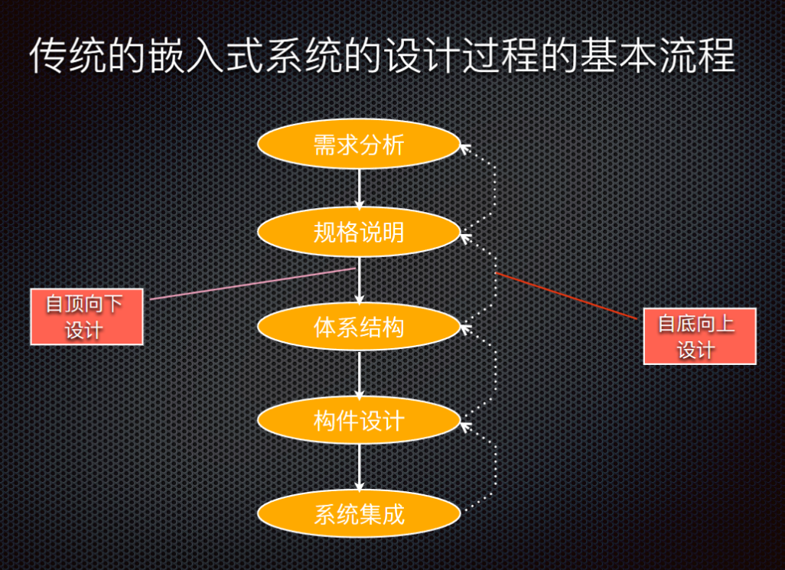

### 基本特征

1. 系统一开始就被划分为硬件和软件两个部分

2. 硬件和软件的设计是分开进行的

3. Hardware First

### 缺陷

1. 软硬件交互收到限制

2. 系统集成相对滞后

## 软硬件的划分

嵌入式系统的设计涉及硬件与软件部件，设计中必须决定什么功能由硬件实现，什么功能由软件实现  

硬件和软件具有**双重性**

软硬件变动对系统的决策造成影响 

划分和选择需要考虑多种因素 

硬件和软件的双重性是划分决策的前提

### 软件实现的功能

1. 操作系统功能（任务调度；资源管理；设备驱动）

2. 协议栈（TCP/IP）

3. 应用软件框架

4. 除基本系统、物理接口、基本逻辑电路，许多由硬件实现的功能都可以由软件实现 

# 12. 物联网

## 定义

物联网，Internet of Things (IoT) ，通过射频识别(RFID)、红外感应器、全球定位系统、激光扫描器等信息传感设备，按约定的协议，把任何物品与互联网相连接，进行信息交换和通信，以实现智能化识别、定位、跟踪、监控和管理的一种网络概念 

物联网是一种计算设备、机械、数字机器相互关系的系统，具备通用唯一识别码（UID），并具有通过网络传输数据的能力，无需人与人、或是人与设备的交互 (Wikipedia)  

“物联网”这个术语已经用来描述一系列技术和研究学科，这些技术和研究学科使互联网能够延伸到物理对象的真实世界 (IoT 2008)  

具有身份和虚拟人格的事物在智能空间中运行，使用智能接口在社会、环境和用户环境中连接和交流  (IoT in 2020) 

## 术语（ITU）

**设备** ：在物联网中，具有强制性通信能力和选择性传感、激励、数据捕获、数据存储和数据处理能力的设备 

**物** ：在物联网中，“物”指物理世界（物理装置）或信息世界（虚拟事物）中的对象，可以被标识并整合入通信网

## IOT特征

**智能**：从生成的数据中提取知识 

**架构**：一个支持许多其他架构的混合架构 

**复杂的系统**：一组动态变化的对象 

**规模**：可伸缩性 

**时间**：数十亿并行和同时发生的事件 

**空间**：定位 

**一切都是服务**：将资源作为服务消费

## IOT优势

**技术优化**：物联网技术有助于技术的改进和提高 

*例如，通过物联网，制造商能够从各种汽车传感器收集数据，制造商对它们进行分析，以改进其设计，使其更有效率*

**改进的数据采集**：传统的数据采集有其局限性，设计为被动使用，物
联网促进了对数据的即时行动 

**减少浪费**：物联网提供实时信息可使资源被有效的管理 

_例如，如果一个制造商在多个汽车发动机中发现一个问题，他可以跟踪这些发动机的制造计划，并用制造皮带解决这个问题_

**提高客户参与度**：物联网允许你通过发现问题和改进流程来改善客户体验 

## IOT不足

**安全**：物联网技术创造了一个连接设备的生态系统，尽管有足够的安全措施，但系统可能缺乏足够的认证控制 

**隐私**：物联网的使用，在没有用户积极参与的情况下，暴露大量的个人数据，这就产生了很多隐私问题 

**灵活性**：主要涉及到与另一个系统的集成，在这个过程中涉及到许多不同的系统  

**复杂性**：物联网系统的设计也相当复杂，此外部署和维护也不是很容易 

**合规性**：物联网有自己的一套规则和法规，然而，由于法规遵循的复杂性，其任务是相当具有挑战性的 

## IOT应用（建议直接看12-1）

消费物联网

* 智能家居

* 可穿戴设备

* 宠物

* 零售金融和营销

医疗保健物联网

智慧城市

* 智慧安防

* 智慧交通

运输业和物流物联网

* 智慧物流

* 智能供应链

能源产业物联网

* 智能电网

工业和制造业物联网用例

* 智能制造

农业和环境物联网用例

* 智能农业

## 物联网体系结构

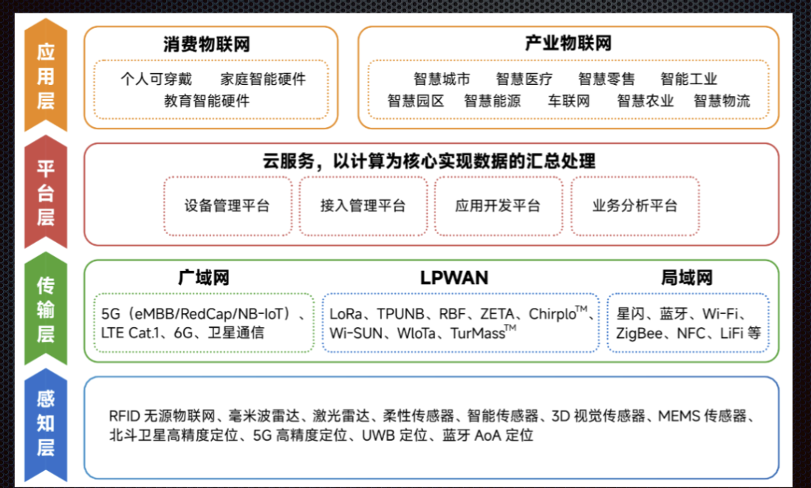

## IOT多样化的技术环境

**硬件**(端设备) 

用于开发设备软件、固件和API的**集成开发环境**（IDE） 

**通信**（RFID、NFC、6LowPAN、Zig Bee、蓝牙、WiFi、2G/4G/
5G） 

**IoT协议**（CoAP、RESTful HTTP、MQTT、XMPP） 

**网络骨干网**（IPv4、IPv6、UDP、6LowPAN） 

**软件** (RIOT OS、Contiki OS、Eclipse IoT) 

**云平台/数据中心**

**机器学习算法和软件**

## 物联网主流软件硬件连接

物联网软件：若干物联网技术已接近成熟，包括**边缘人工智能**、**基于物联网的流分析**、**监督和非监督机器学习**  

物联网硬件：现有物联网技术被归类为相当成熟或主流包括**cpu、mcu、gpu、安全芯片、FPGA**和**边缘网关** 

物联网连接：**eSIM、mesh网络、5G**和**Wi-Fi 6**，接近成熟

## 物联网的挑战

## 技术上

**安全** 

保护联网设备、设备的网络及其所产生的数据 

**标准和互操作性** 

物联网涉及到多种设备、协议和平台，确保不同制造商的各种设备之间的无缝通信和数据交换变得复杂 挑战包括设备之间的互联互通、数据格式的统一、通信协议的标准化等 

**可扩展性** 

随着连接设备的数量呈指数级增长，有效管理和维护这些设备变得更加困难，只有不断提高物联网网络的可扩展性才能满足对互联设备不断增长的需求 

**可靠性和延迟** 

确保物联网设备与云或中央服务器之间的一致连接和最小延迟对于平稳高效的运营至关重要 

**设备功耗** 

低功耗设计、能量收集和高效通信协议是解决这一挑战的一些方法 

**智能分析与动作**

## 商业上和社会上（未知ppt没有）

# 13．IOT平台

## 概念

物联网平台是一种**多层技术**，能够在物联网领域中**直接****提供**、**管理**和**自动化连接设备**

_通过使用灵活的连接选项、企业级安全机制和广泛的数据处理能力，无论硬件多样化如何都将硬件连接到云_

对于开发者来说，物联网平台提供了一套随时可用的功能，极大地加快了联网设备应用程序的开发，同时兼顾了**可扩展性**和**跨设备兼容性** 

## IOT平台作为中间件

物联网平台起源于物联网中间件的形式，其目的是充当**硬件层和应用层之间的中介**

主要任务包括通过不同的协议和网络拓扑从设备**收集数据**、**远程设备配置和控制**、**设备管理和空中固件更新**

要在实际的异构物联网生态系统中使用，物联网中间件期望能够支持几乎所有可连接设备，将之集成，并与设备使用的第三方应用程序融合 

这种独立于底层硬件和软件的特性，允许一个物联网平台以同样直接的方式管理任何类型的连接设备 

## 功能领域（详细参考ppt 13-1）

1. 使设备连接管理简单 

2. 接收、存储和发送数据 

3. 帮助企业可视化设备数据并提供关键的见解 

4. 提供特定于应用程序的支持和数据 

5. 是否有知识渊博、反应灵敏的支持团队 

6. 提供健壮的安全 

7. 提供支持物联网解决方案特定需求的定制 

8. 一致的产品交付和平台更新

## IOT平台关键技术

设备管理，边缘计算，通信协议，模型压缩技术，面向物联网端的边缘计算开源平台

## 设备管理

### 概念

设备管理服务, 可以帮助对所有连接的设备, 在全球范围内进行规模化的注册、查看及远程管理

### 主要功能

生命周期 

设备分组 

设备影子 

物模型 

数据解析 

数据存储 

在线调试 

固件升级 

远程配置 

实时监控等

### 物模型

物模型（Thing Model）是对设备在云端的功能描述，包括设备的属性、数据、服务和事件  

物联网平台通过定义一种物的描述语言来描述物模型，称之为 TSL（即 Thing Specification Language），采用JSON格式，可以根据TSL组装上报设备的数据 

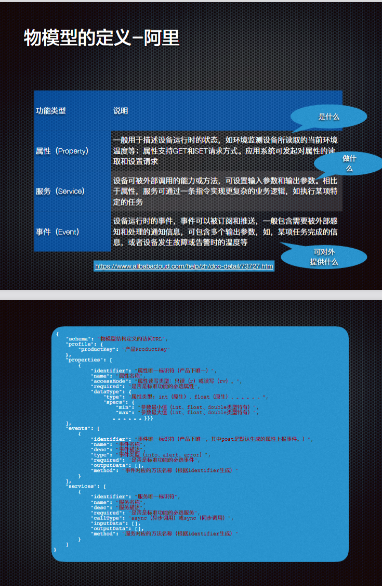

### 设备影子

物联网平台提供设备影子功能，用于**缓存设备状态**

* 设备在线时，可以直接获取云端指令 

* 设备离线后，再次上线可以主动拉取云端指令  

设备影子是一个**JSON 文档**

* 存储设备上报状态 

* 应用程序期望状态信息   

**每个设备有且只有一个设备影子**，设备可以通过MQTT获取和设置设备影子来同步状态 

* 该同步可以是影子同步给设备，也可以是设备同步给影子  

应用场景

* 网络不稳定，设备频繁上下线；多程序同时请求获取设备状态；设备掉线 

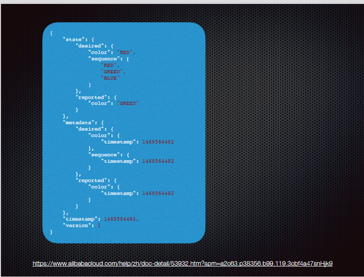

### 数据孪生

#### 概念

数字孪生，英文名叫Digital Twin（数字双胞胎），也被称为数字映射、数字镜像

数字孪生，是充分利用物理模型、传感器更新、运行历史等数据，集成多学科、多物理量、多尺度、多概率的仿真过程，在虚拟空间中完成映射，从而反映相对应的实体装备的全生命周期过程 

#### 价值

**可见性**: 数字孪生能够实现机器操作的可见性，以及制造工厂或者机场中大型的互联系统的可见性  

**预测性**: 使用多种建模技术(基于物理和基于数学的)，数字孪生模型能够用于预测机器未来的状态  

**假设分析**: 通过适当设计的接口，可以很容易的与模型进行交互，并且对模型询问假设问题，来模拟现实中无法创建的各种条件 

**对行为进行理解和解释的记录与沟通机制**：数字孪生模型能够作为一种沟通和记录机制，能够对单独的机器或者机器的集合的行为进行理解和解释  

**连接不同的系统**：比如后端的业务应用 

* 如果设计的正确，数字孪生模型能够用来连接后端的业务应用，在供应链运作中实现业务成果，包括制造、采购、仓储、运输、物流、现场服务等

#### 概念辨析

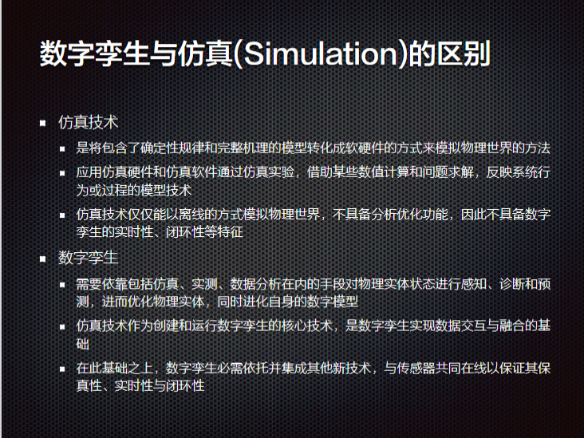

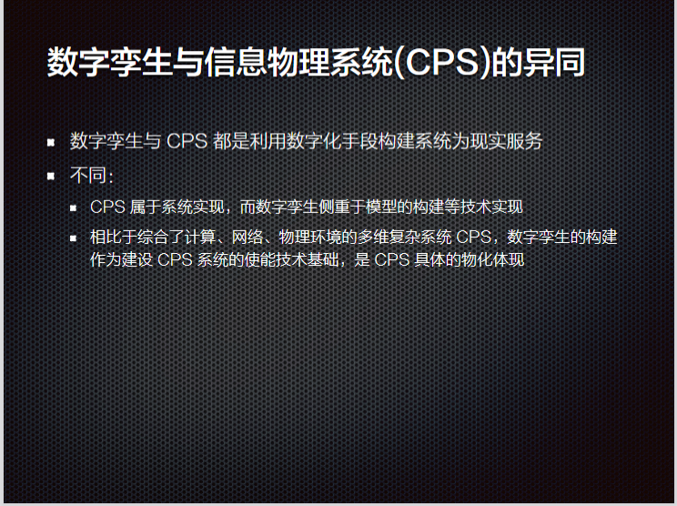

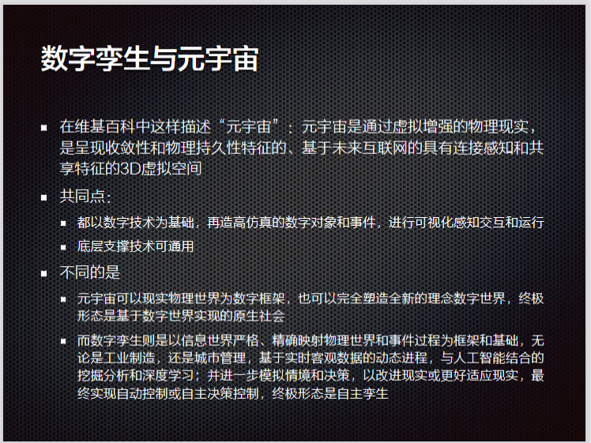

#### 应用

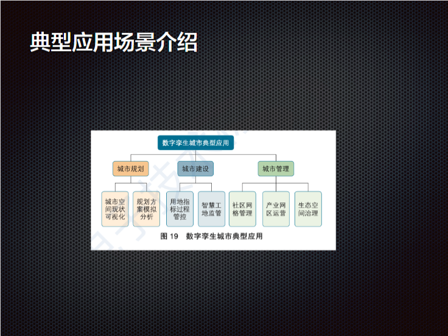

## 通信协议

### 主流技术（不太确定他到底要我们记什么）

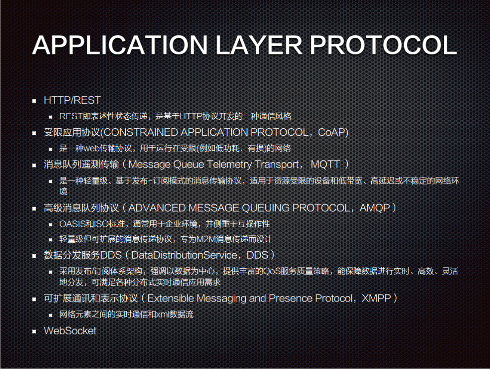

### 应用层协议

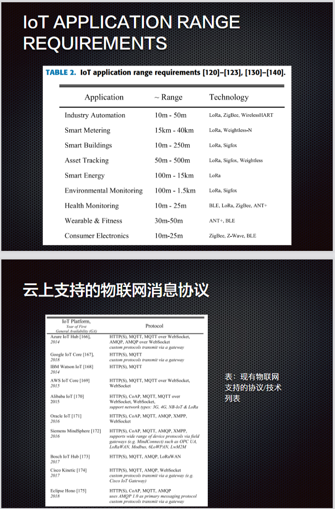

### 多协议接入方案

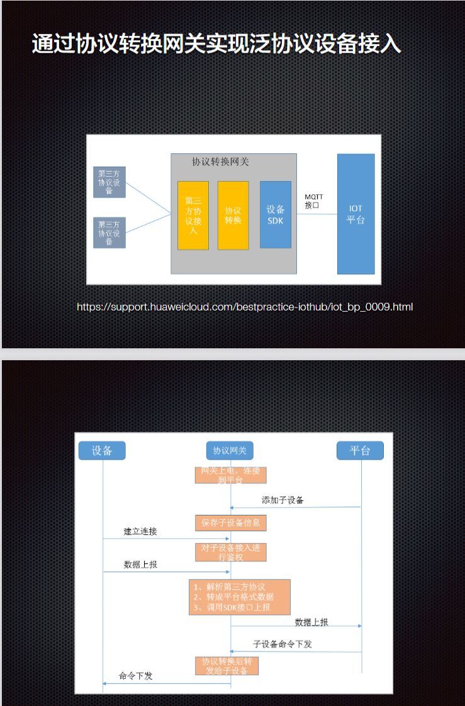

## 边缘计算

### 基于云的IOT解决方案不足

首先，对于大规模边缘的多源异构数据处理要求，**无法在集中式计算线性增长的计算能力下得到满足** 

* IOT感知层是海量数据，数据具有很强的冗余性、相关性、实时性和多源异构性，数据之间存在着频繁的冲突与合作

* 需要实时处理  

其次，数据在用户和云数据中心之间的长距离传输将导致**高网络时延和计算资源浪费**  

再次，大多数终端用户处于网络边缘，通常使用的是**资源有限**的移动设备，具有低存储和计算能力以及有限的电池容量，所以有必要将一些不需要长距离传输到云数据中心的任务**分摊到网络边缘端**

最后，云计算中数据**安全性和隐私保护**在远程传输和外包机制中将面临很大的挑战，使用边缘计算处理数据则可以降低隐私泄漏的风险

### 概念

**边缘的概念**：我们将“边缘”定义为数据源和云数据中心之间的任何计算和网络资源 

**边缘计算的概念**：

SO/IEC JTC1/SC38：边缘计算是一种将主要处理和数据存储放在
网络的边缘节点的分布式计算形式 

国际标准组织ETSI的定义为在移动网络边缘提供 IT 服务环境和计算能力，强调靠近移动用户，以减少网络操作和服务交付的时延，提高用户体验 

### 云边对比

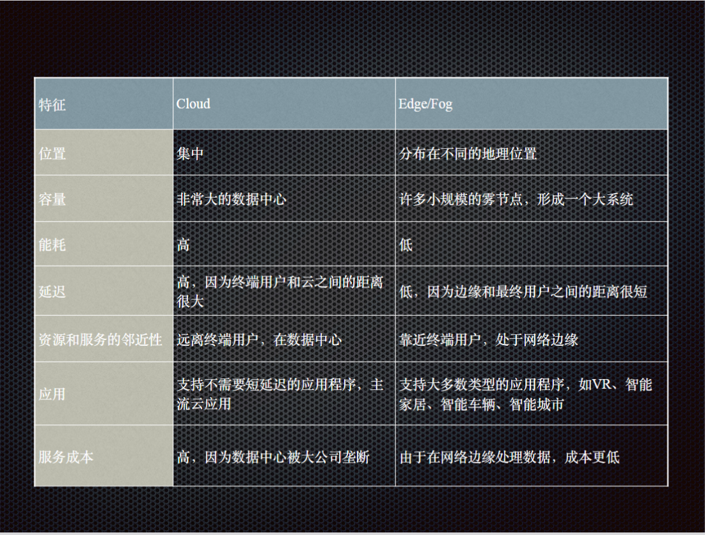

### 边缘计算优势

**减少带宽**：在源头处理数据，消除了将图像传输回中央服务器的需要。由于只发送可操作的信息，因此所需的带宽要少得多。

**减少延迟**：减少从边缘发送的数据量可以加快系统速度，并最大限度地减少捕获图像和到达信息之间的延迟

**改善隐私提升安全性**：车牌、人脸等敏感信息不会传输到云端。

### 边缘计算应用

**智能交通系统**: 更低的带宽消耗，提高系统安全性，降低隐私风险

**工业自动化**: 更低的延迟和抖动，以实现更高的吞吐量

**自动驾驶车辆导航**: 最大限度地减少系统延迟，使高速车辆能够快速做出决策，同时消除需要始终在线的数据连接的依赖

### 模型压缩技术

学术界和工业界普遍采用模型压缩技术来提高边缘设备上的学习效
率，用于**减小模型规模，能够提高计算速度并降低边缘设备的计算负担**

**模型裁剪**：可移除不必要的模型参数或层以简化模型 

**参数量化**则减少参数所需的位数来降低模型的存储和计算需求 

这些方法有效缓解了边缘设备上模型部署的约束条件（如计算能力、存储空间的限制）

# 14．Arduino (这章开始为实验部分)

## 为何流行 
- 跨平台的 
- 简单，清晰的编程环境 
- 开放源码和可扩展软件 
- 开源和可扩展硬件 
- 便宜

# 15．传感器

## 静态特性
- 灵敏度：稳态时输出量与输入量之比 
- 分辨力：在规定的测量范围内能够检测出的被测量的最小变化量 
	- 往往受噪声的限制 
	- 与分辨率不同 
- 测量范围和量程：能够测量的下限值与上限值之间的范围为测量范围，上限值与下限值的差称为量程 
- 误差特性： 
	- **零漂：传感器无输入（或某一输入值不变）时，每隔一段时间，其输出值偏离原始值的最大偏差与满量程的百分比** 
	- **温漂：温度每上升1℃，传感器输出值的最大偏差与满量程的百分比**
## 误差
- 测量系统及标准量本身精度有限 
- 实验手段不完善 
- 有些方法在理论上就是近似的 
- 多数被测值不可能用一个有限数字表示出来 
- 被测量是随时间变化的 
- 外界噪声的干扰 
- 感知信息的不确定性 
## 标定
利用已知的输入量输入传感器，测量传感器相应的输出量， 进而得到传感器输入、输出特性的过程（确定对应关系，同时也确定不同使用条件下的误差关系）

传感器的标定有两层含义： 
- 确定传感器的性能指标 
- 明确这些性能指标所适用的工作环境

# 16．ROS
## 相关概念
- 节点Nodes 
	- 单一用途的可执行程序
	- 单独编译、执行和管理
- 节点管理器ROS Master 
	- 为各节点提供连接信息，以便各节点之间互通消息
- 消息和主题Messages and Topics 
	- 主题：已定义类型的命名消息流
	- 发布者/订阅者模式: 广播，单个节点可以发布和订阅多个主题
	- 消息：用于节点间通信的严格类型的数据结构
- 服务Services 
	- 同步节点间事务
	- 请求-响应
- 动作action 
	- 与服务类似，动作客户端向动作服务器发送请求以实现某些目标并获得结果
	- 与服务不同，在执行动作时，动作服务器会向动作客户端发送进度反馈消息
- 参数Parameters 
- 包Packages、栈Stacks、Meta Packages
	- ROS中的软件以包的形式组织 包的目标是创建易于重用的最小代码集合
	- 栈的目标是简化代码共享过程。栈是ROS中用于分发软件的主要机制
	- Meta packages: 该meta package是指由特定目的组成的一个包集合，替代Stack

## 为何使用
- 社区
- 模块化与可拓展性
- 易于使用

# 17．PID算法及应用

## 反馈控制
反馈控制是指将系统的输出信息返送到输入端，与输入信息进行比 较，并利用二者的偏差进行控制的过程
## 开环控制
无反馈系统
是指在一个控制系统中系统的输入信号不受输出信号影响的控制系统, 也就是，不将控制的结果反馈回来影响当前控制的系统 
若组成系统的元件特性和参数值比较稳定，且外界干扰较小，开环控制能够保持一定的精度 
缺点：精度通常较低、无自动纠偏能力 
典型应用： 自动售货机、自动洗衣机、产品自动生产线、自动门

## 闭环控制
闭环控制是指作为被控的输出量以一定方式返回到作为控制的输入端，并对输入端施加控制影响的一种控制关系，即带有反馈信息的系统控制方式 
优势：精确 自适应调节 稳定性高 
应用：温控、无人机飞控、电机控制。。。恒温加热器、太阳能系统
## PID算法
在过程控制中，按偏差的比例（P）、积分（I）和微分（D）进行控制

