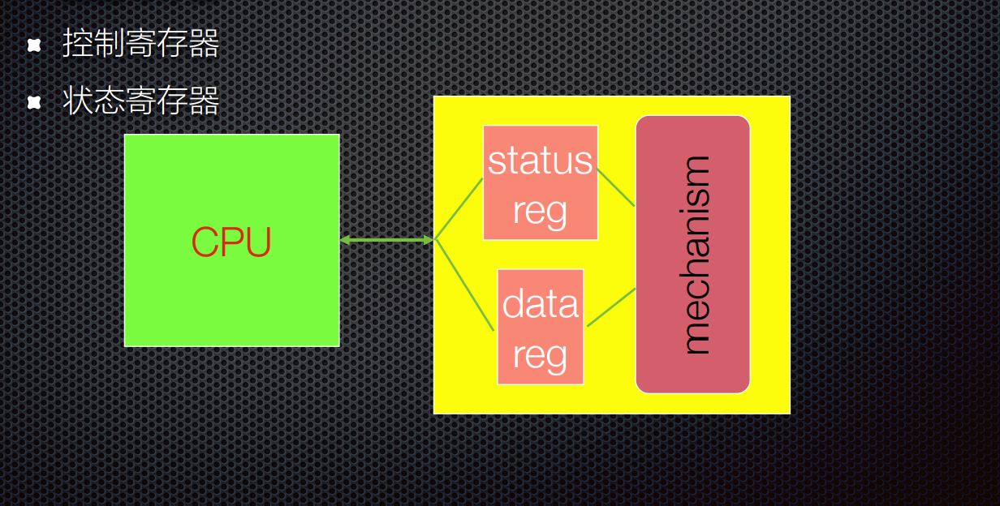
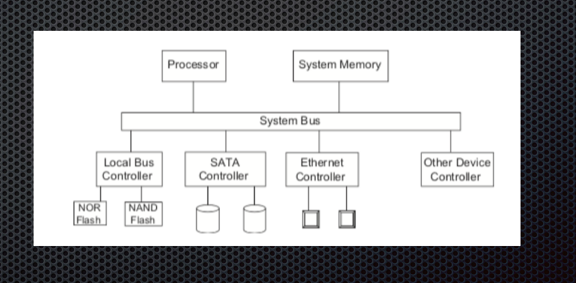
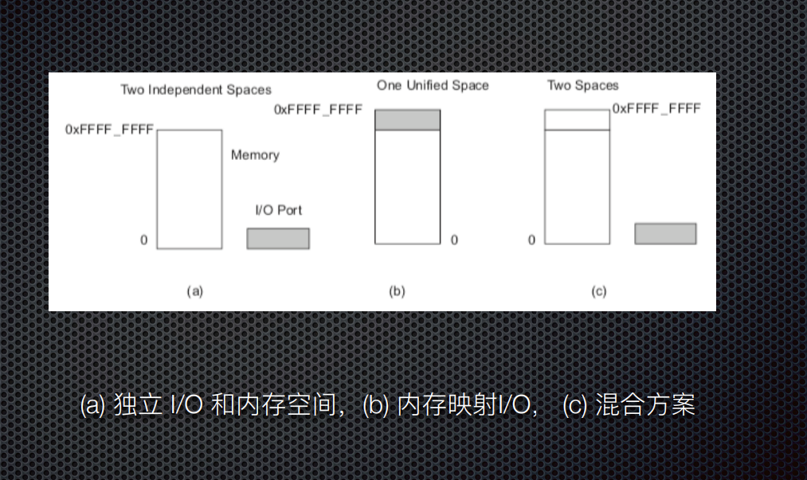

# IO接口

数据寄存器

控制寄存器

状态寄存器

# 分类-从属

系统设备： 操作系统启动的时候已经在系统中注册的标准设备

用户设备：。。。。

通常设备驱动程序是由用户提供的，用户必须以某种方式将这些设备的控制权转移到操作系统进行管理典型的设备包括SD卡、u盘等

# 分类-使用

专用设备

共享设备

虚拟设备

# 类别-信息传输单元

块设备： 以数据块为单位组织和交换数据，即使是一个单字节的读写，也应该读写整个数据块

字符设备： 以字符单位组织和交换数据

如串口，触摸面板，打印机

字符设备的基本特征是传输速率低且不可寻址，当字符设备执行I/O操作时，经常使用中断

# 结构

# 8251 UART

Universal asynchronous receiver transmitter (UART)

包括了RS232、RS449、RS423、RS422和RS485等接口标准规范和总线标准规范，即UART是异步串行通信口的称

# 可编程IO

在通信过程中选择控制寄存器或者数据缓冲区的三种方法

* 独立的IO端口

不占内存地址空间

指令清晰

译码电路简单

* 内存映射IO

* 混合解决方案

Intel x86提供了in, out指令，大多数其他cpu使用内存映射IO

# 中断优先级

屏蔽：在挂起的中断完成之前，不会识别优先级低于当前优先级的中断

不可屏蔽中断NMI：最高优先级，从不被屏蔽

# 中断序列

* CPU确认请求

* 设备发送向量

* CPU调用中断处理程序

* 软件处理请求

* CPU 恢复前台程序状态

# 可重入

嵌入式中例程必须满足以下条件才能重入

* 以原子方式使用所有共享变量，除非每个共享变量分配给函数的特定实例

* 不调用不可重入的函数

* 不以非原子的方式使用硬件

# 竞态条件

设备和系统出现不恰当的执行时许，从而得到不正确的结果

