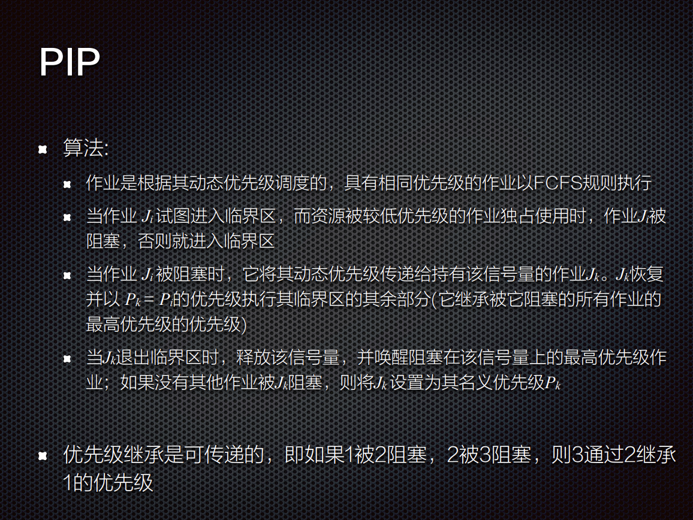
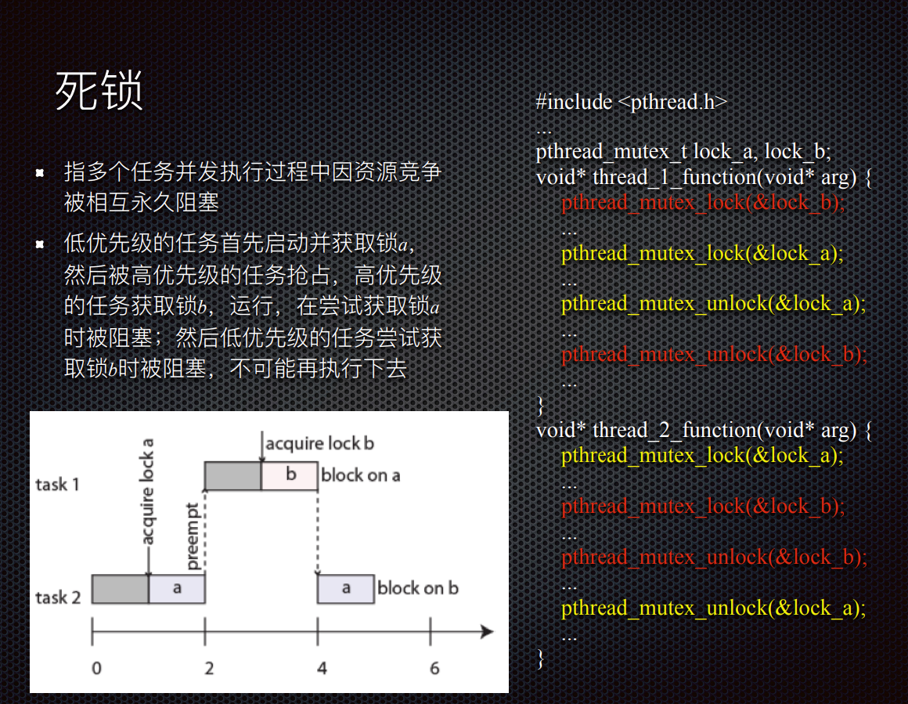
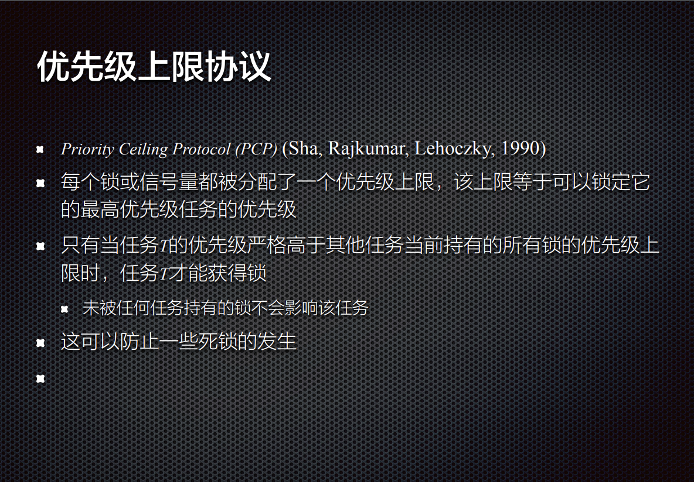
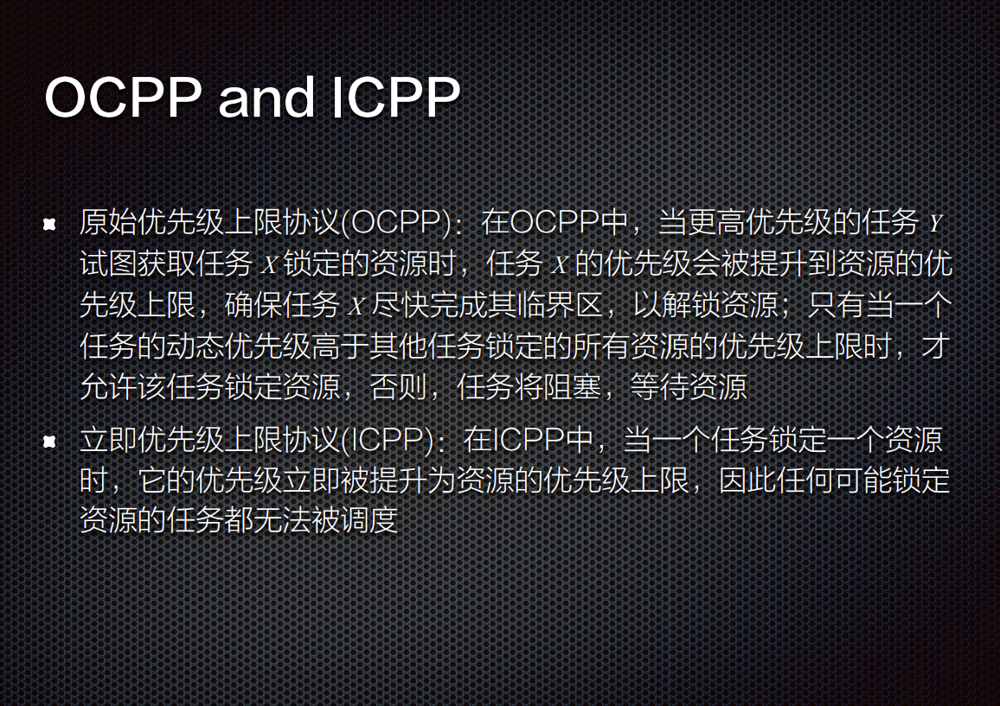
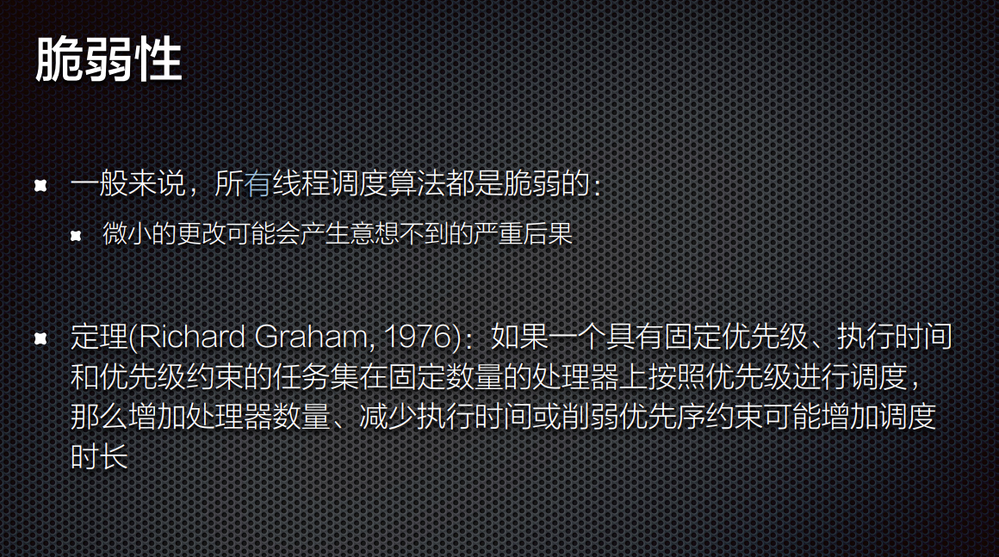

互斥

优先级反转

* 优先级继承

* 优先级天花板

多处理器调度

* Richard异常

# 优先级继承协议

Priority Inheritance Protocol (PIP) (Sha, Rajkumar, Lehoczky, 1990)

假设:

n 个任务通过 m 个共享资源进行协作

固定优先级，一个资源上的所有临界区都以wait(Si)开始，以signal(Si)操作结束

基本思想:

当任务Ji阻塞一个或多个高优先级任务时，它暂时假定(继承)被阻塞任务的最高优先级

术语:

固定的名义优先级（nominal priority ）Pi 和大于或等于Pi 的动态优先级（active priority），作业J1……Jn按照名义优先级排序，其中J1具有最高优先级，作业不会自动中止

# PIP算法

# 优先级上限协议

## OCPP 和 ICPP

# 脆弱性

定理(Richard Graham, 1976)：如果一个具有固定优先级、执行时间

和优先级约束的任务集在固定数量的处理器上按照优先级进行调度，

那么增加处理器数量、减少执行时间或削弱优先序约束可能增加调度时长

## 结论

在所有已知的任务调度策略下，时限行为都是脆弱的

小的改变会产生大的(意想不到的)后果

不幸的是，由于执行时间很难预测，这种脆弱性可能导致意外的系统故障

嵌入式软件对时序效果特别敏感，这是因为与外部物理系统的交互是不可避免的