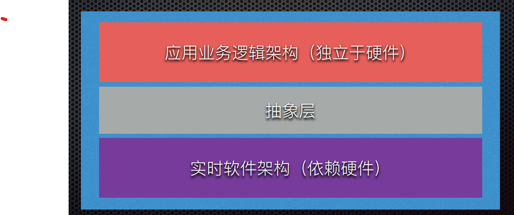
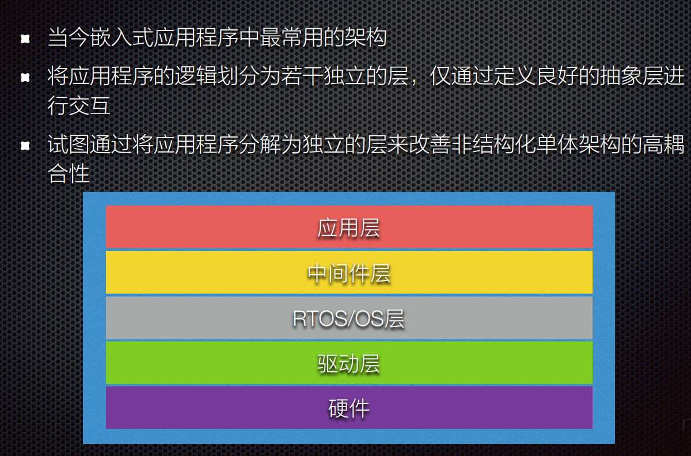
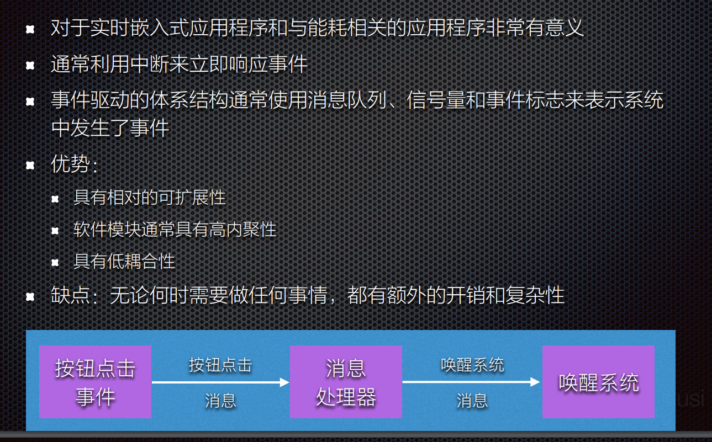
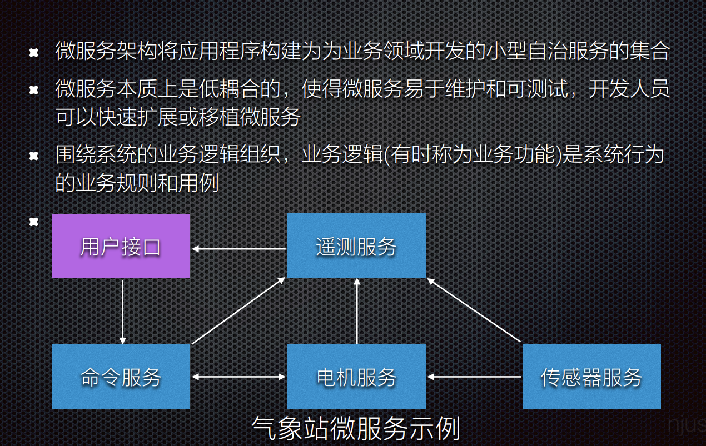
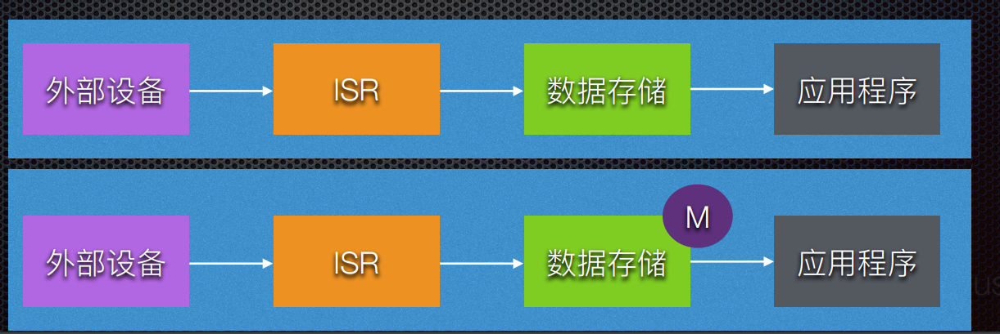
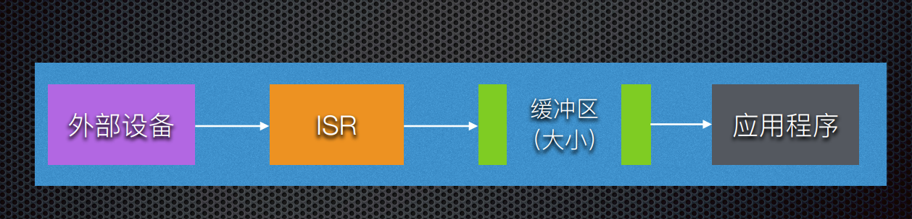
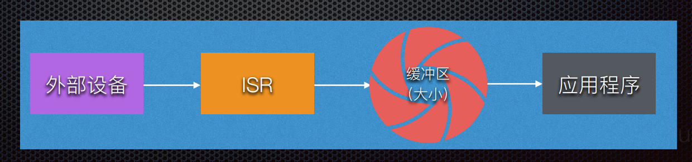
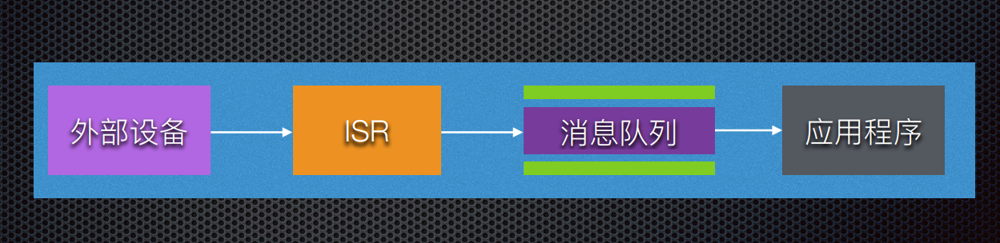

# 嵌入式和桌面软件的对比

* 内存 ： 有限

* CPU： 成本和功耗的考虑，ES不得不采用保守的设计方案，CPU往往只是恰好满足需求

* 操作系统： OS RTOS 专有OS/裸机

* 实时行为

    * 实时系统不一定运行的很快，但是一定是可以预测的，通常的属于叫做确定性

    * 实时性要求对于OS的选择和程序设计都有影响

* 开发流程

    * 交叉开发，对于工具的选择有很大的影响，往往没有足够的资源进行软件开发

    * 开发的过过程不同，编辑/编译/调试/调试的循环是一样的，但是执行程序这一步却非常复杂。

* 执行流程

    * 多数嵌入式设备从开机开始就会运行某一个程序，该程序会一直运行到系统关机，这个程序可能储存在ROM，也可能是从非易失性存储器转移到RAM中执行

* 每一个嵌入式设备是不同的

    * 技术层面或者是商业运作层面

* 嵌入式软件开发工具有显著的不同

    * 交叉编译器

    * 小部分直接包含的汇编代码

    * linker

    * 调试器

* 软件组件

# 软件/硬件的权衡

微处理器的选择

内存大小和组合

需要认真考虑设计中包含哪些外设

# 调试

在线仿真器ICE

监控调试器

片上调试

# 自检

* IO电路

* 板载开关

* 状态显示

    * 可能是字符或者只是LED

    * LED至少可以有3种状态

        * 开关闪烁

# 软件系统层次结构

....

# Apollo 8.0 

# 为什么要为实时系统建立模型

* 辅助测试和完善最终系统

* 更加重要的是，模型利用他所致的系统属性来描述整个系统，并且能够被用于对于系统特性的进一步研究

。。。

# 模型间的差异

抽象程度

一些模型使得程序运行的快，但是需要付出更多的内存资源消耗的代价

模型准确性和鲁棒性

# 现代嵌入式软件开发

依托传统方法

仍然使用传统方式，但是更加复杂

仍然使用传统的软件堆栈

平台配置工具

应用程序代码不再是手工编码，而是通过建模和管理配置自动生成代码

测试现在在被复杂地构建到开发过程种

CICD流程

# 嵌入式软件架构

分为两部分： 业务逻辑， 实时依赖硬件地逻辑

抽象层将所需地操作地高级请求转化为操作所需地低级命令

# 非结构化单体结构

# 微服务架构

# 管理外设数据

* 主要的设计理念之一是数据决定设计

* “如何将数据从外围设备”

## 轮询

优点：简单，没有数据共享问题

缺点： 浪费处理周期，在资源受限或者低功耗系统种这些枸杞可能会显著增加

# 嵌入式软件架构

分为两部分

* 业务逻辑

* 实时依赖硬件的逻辑

抽象层讲所需操作的高级请求转换成所需的低级指令

# 嵌入式软件架构模式

基于微控制器的系统来说，最常用的模式包括

* 非结构化单体架构

* 分层架构

* 事件驱动架构

* 微服务架构

## 非结构化的单体结构

很容易构建，但是很难维持规模和移植

与应用层的应用程序紧密耦合

## 分层架构

## 事件驱动架构

## 微服务架构

# 实时嵌入式软件常用的设计模式

* 单核

* 多核

* 发布和订阅模型

* RTOS模式

* 中断

## 管理外设数据

轮询

中断

直接存储器访问

# 数据获取，存储相关的中断设计模式

线性数据存储

乒乓缓冲/双缓冲

环形/循环缓冲

带有信号量的循环缓冲区

带有事件标识的循环缓冲区

消息队列

# DMA

Directory memory access

无需CPU的交互情况下在RAM和外设之间以及内部传输数据

# RTOS应用程序设计模式

在RTOS应用程序中，通常有两种类型的同步

资源同步：决定了对共享资源的访问是否安全

活动同步：决定执行是否已达到特定状态

资源同步和活动同步设计模式有多种形式和大小

## 中断锁

中断锁定可能是有用的，但在实时嵌入式系统中可能会导致许多问题
例如，通过在读取操作期间禁用中断，中断可能会被错过，或者在最好的情况下，延迟执行，延迟执行会给系统增加不必要的延迟甚至抖动

## 抢占锁

抢占锁可用于确保任务在执行临界区期间不间断，抢占锁在临界区期
间临时禁用RTOS内核抢占调度程序

关键的系统中断仍然允许运行

## 互斥锁

# 活动同步

## 单向同步

## 双向同步

## 多个任务之广播设计模式

## 发布和订阅模型

## 低功耗应用程序设计模式

关于低功耗设计模式，主要模式是尽可能地保持设备关闭

## 多核架构

同构多核

异构多核架构

